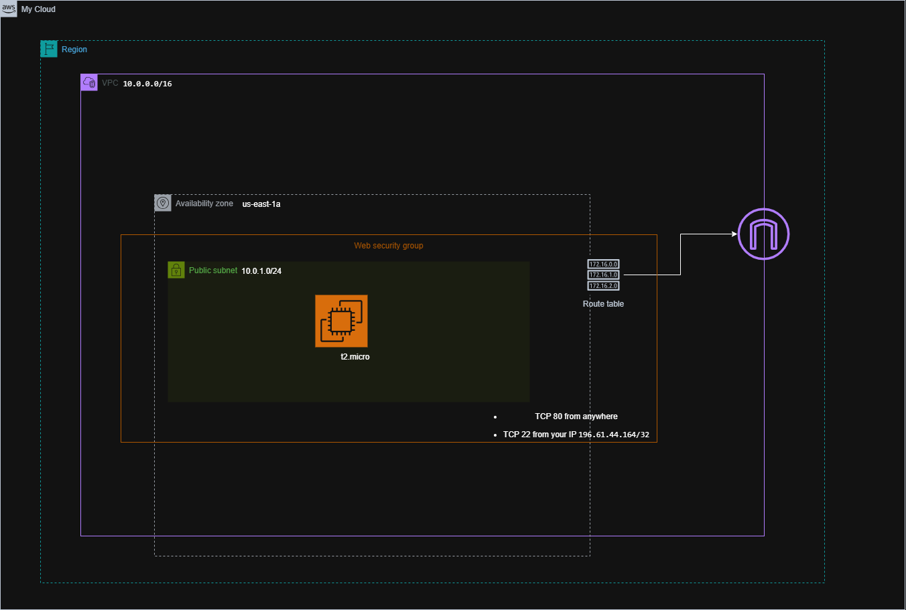

# Terraform AWS Foundation – Infrastructure as Code (IaC)

## 📌 Project Overview

This project demonstrates the use of **Terraform (v1.5+)** to provision foundational AWS infrastructure following **Infrastructure as Code (IaC)** best practices. It includes a **remote backend** configured with **Amazon S3 for state storage** and **`use_lockfile = true`** for state locking, ensuring safe and consistent deployments.  
The S3 backend is configured in `backend.tf` and expects an existing S3 bucket (for example `projectiacterraformstatebucket`) in the configured AWS region.

All resources were created using **AWS Free Tier–eligible services** and successfully created and destroyed using Terraform.

---

## 🎯 Objectives Achieved

- ✅ Defined AWS infrastructure using Terraform
- ✅ Implemented **modular Terraform design**
- ✅ Configured **remote backend with S3 + lockfile**
- ✅ Stored Terraform **plan, apply, and destroy outputs** as files
- ✅ Verified resources in AWS Console
- ✅ Clean teardown with no leftover resources

---

## 🏗️ Architecture & Resources Created

### Networking
- **VPC**
- **Public Subnet**
- **Internet Gateway**
- **Route Table** with default route

### Security
- **Security Group:**
  - SSH (22) allowed from **my public IP**
  - HTTP (80) allowed from **0.0.0.0/0**

### Compute
- **EC2 instance** (`t2.micro`)
- **SSH key pair** (Terraform-managed)

### Backend
- **Amazon S3 bucket** (Terraform remote state, configured in `backend.tf`)
- **Lockfile** mechanism (`use_lockfile = true`) for safe state updates

---



## 📁 Project Structure

```
I-A-C/
├── backend.tf
├── main.tf
├── variables.tf
├── outputs.tf
├── terraform.tfvars
├── README.md
├── modules/
│   ├── vpc/
│   ├── security/
│   ├── ec2/
│   └── keypair/
└── screenshots/
    ├── Terraforminit.png
    ├── terraformPlan.png
    ├── terraformApply.png
    ├── TerraformDestroy.png
    ├── s3-backend.png
    ├── Dynamodb-table.png
    └── ec2Console.png
```

---

## 🔐 Remote Backend Configuration

Terraform remote state is configured to:

- Store state files in **Amazon S3**
- Use `use_lockfile = true` for **state locking**
- Prevent concurrent state corruption without requiring DynamoDB

Backend configuration is defined in `backend.tf`.  
You must create the S3 bucket referenced there (for example `projectiacterraformstatebucket`) and ensure your AWS credentials have permission to read/write objects in that bucket.

**📸 Evidence provided:**
- S3 bucket containing Terraform state file
- `terraform init` showing lockfile usage
- Successful creation, update, and destroy operations

---

## 🚀 Terraform Commands Used

```bash
terraform init
terraform plan
terraform apply
terraform destroy
```

If you change the backend configuration in `backend.tf` (for example, updating the S3 bucket name or region), re-run:

```bash
terraform init -reconfigure
```

**Screenshots of the workflow and resources are available in the `screenshots/` directory.**


> **Note:** The `tee` command ensures outputs are both displayed in the terminal **and saved to files** for auditing or submission.

---

## 📤 Terraform Outputs

```hcl
ec2_public_ip = "44.212.60.64"
vpc_id = "vpc-0fde32fd37da66ade"
```

These outputs confirm successful provisioning of networking and compute resources.

---

## 🧪 Verification

- ✅ EC2 instance verified in AWS Console
- ✅ Public IP assigned and reachable
- ✅ Security group rules correctly applied
- ✅ Terraform state stored remotely in S3
- ✅ Lockfile observed during apply

**📸 Screenshots are available in the `screenshots/` directory.**

---

## ⚠️ Challenges Faced & Solutions

### 1. EC2 Key Pair Not Found Error

**Issue:** Terraform failed with:
```
InvalidKeyPair.NotFound
```

**Cause:** The EC2 module referenced a key pair that did not exist in AWS.

**Solution:**
- Created a **dedicated keypair module**
- Generated the SSH key using `tls_private_key`
- Uploaded the public key using `aws_key_pair`
- Passed the key name into the EC2 module via the root module

✅ **Result:** EC2 launched successfully.

---

### 2. Remote Backend Bootstrapping

**Issue:** Terraform cannot create its own backend resources automatically.

**Solution:**
- Configured **S3 bucket as backend**
- Enabled **`use_lockfile = true`** for state locking
- Re-ran `terraform init`

---

### 3. Module Dependency Management

**Issue:** Modules cannot directly reference each other.

**Solution:**
- Used the **root module** to pass outputs from the keypair module into the EC2 module
- Maintained loose coupling and reusable design

---

## 🔐 Security Considerations

- 🔒 Private SSH key (`.pem`) is excluded via `.gitignore`
- 🔒 SSH access restricted to a single IP
- 💰 All resources are Free Tier compatible

---

## 🧹 Cleanup

All infrastructure was cleanly destroyed using:

```bash
terraform destroy
```

The destroy output is stored in `outputs/terraform-destroy.txt`.

---

## 🧠 Key Learnings

- Terraform module design and composition
- Remote backend configuration with **lockfile** for safe state management
- Real-world Terraform debugging
- Auditable infrastructure lifecycle using stored outputs

---

## 📎 Evidence Included

- ✅ Terraform plan/apply/destroy output files in `outputs/`
- ✅ AWS Console screenshots (EC2, VPC, S3)
- ✅ Terraform outputs
- ✅ Backend configuration proof

---

## 📚 Additional Resources

- [Terraform Documentation](https://www.terraform.io/docs)
- [AWS Free Tier](https://aws.amazon.com/free)
- [Terraform AWS Provider](https://registry.terraform.io/providers/hashicorp/aws/latest/docs)

---

## 👤 Author

**Asher Yram Tetteh-Abotsi**  
DevOps Engineer | Cloud Infrastructure Specialist

---

## 📄 License

This project is licensed under the MIT License - see the LICENSE file for details.